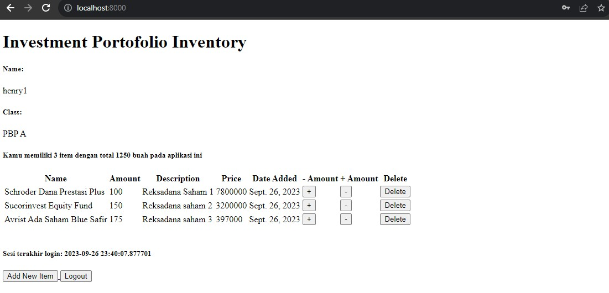
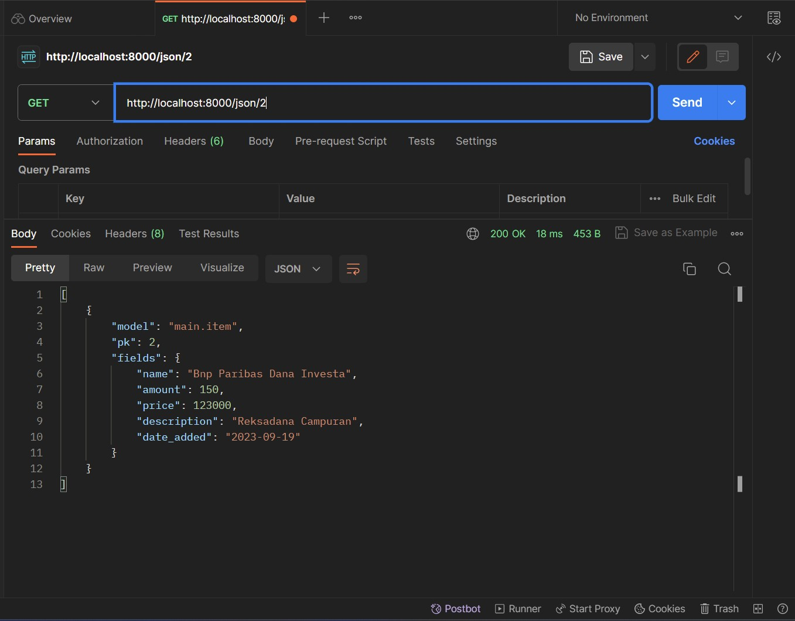

[Investment Portofolio Inventory Application Link](http://henry-soedibjo-tugas.pbp.cs.ui.ac.id/)
<h1>Tugas 6</h1>

# Implementasi

## Membuat Fungsi Create Item, Delete Item, Get Item, dan Get Total Item Menggunakan AJAX 
1. Bukalah file `main.html` yang terletak di dalam direktori `main/templates`. Tambahkan fungsi berikut
```
<script>
        async function getItems() {
            return fetch("").then((res) => res.json())
        }

            function addItem() {
                fetch("", {
                    method: "POST",
                    body: new FormData(document.querySelector('#form'))
                }).then(refreshitems)

                document.getElementById("form").reset()
                return false
            }

            function deleteItem(itemId){
                fetch(`/delete-ajax/${itemId}/`, {
                    method: "DELETE",
                }).then(refreshitems)
                return false
            }
            
            document.getElementById("button_add").onclick = addItem
    </script>
```
2. Bukalah file `views.py` pada direktori `main` dan definisikan fungsinya
```
def get_item_json(request):
    item_item = Item.objects.filter(user=request.user)
    return HttpResponse(serializers.serialize('json', item_item))

@csrf_exempt
def add_item_ajax(request):
    if request.method == 'POST':
        name = request.POST.get("name")
        price = request.POST.get("price")
        amount = request.POST.get("amount")
        description = request.POST.get("description")
        user = request.user

        new_item = Item(name=name, price=price, amount=amount, description=description, user=user)
        new_item.save()

        return HttpResponse(b"CREATED", status=201)
    return HttpResponseNotFound()

@csrf_exempt
def delete_item_ajax(request, id):
    if request.method == 'DELETE':
        a = Item.objects.get(pk=id)
        a.delete()
        return HttpResponse(b"DELETE", status=201)
    return HttpResponseNotFound()
```
3. Bukalah file `urls.py` pada direktori `main` dan tambahkan path berikut
```
...
    path('get-item/', get_item_json, name='get_item_json'),
    path('create-ajax/', add_item_ajax, name='add_item_ajax'),
    path('delete-ajax/<int:id>/', delete_item_ajax, name='delete_item_ajax')
```

## Membuat Script untuk Menampilkan Item
1. Pada file `main.html` tambahkan kode berikut
```
 async function refreshitems() {
        document.getElementById("item_table").innerHTML = ""
        const items = await getItems()
        let htmlString = ``
        
        items.map((item, i) => {
            htmlString += `\n
            <div class="card ${i === items.length - 1 ? 'new-card' : ''}">
                    <h3>${item.fields.name}</h3>
                    <p>Description: ${item.fields.description}</p>
                    <p>Amount: ${item.fields.amount}</p>
                    <p>Date Added: ${item.fields.date_added}</p>
                    <div class="card-buttons">
                        <a href="/remove/${item.pk}/">
                            <button class="btn btn-danger">Remove</button>
                        </a>
                        <a href="/add/${item.pk}/">
                            <button class="btn btn-success">Add</button>
                        </a>
                        <a>
                            <button class="btn btn-warning" onclick = deleteItem(${item.pk})>Delete</button>
                        </a>
                    </div>
                </div>` 
            })
            
            document.getElementById("item_table").innerHTML = htmlString
            }

            refreshitems()
```
+ Lalu di `main.html`, bagian menampilkan card yang lama dihapus dan diganti menjadi `<div id="item_cards"></div>`.

## Membuat Modal FOrm dalam Menambahkan Item
Pada file `main.html` tambahkan kode berikut
```
        <div class="modal fade" id="exampleModal" tabindex="-1" aria-labelledby="exampleModalLabel" aria-hidden="true">
            <div class="modal-dialog">
                <div class="modal-content">
                    <div class="modal-header">
                        <h1 class="modal-title fs-5" id="exampleModalLabel">Add New Item</h1>
                        <button type="button" class="btn-close" data-bs-dismiss="modal" aria-label="Close"></button>
                    </div>
                    <div class="modal-body">
                        <form id="form" onsubmit="return false;">
                            
                            <div class="mb-3">
                                <label for="name" class="col-form-label">Name:</label>
                                <input type="text" class="form-control" id="name" name="name"></input>
                            </div>
                            <div class="mb-3">
                                <label for="price" class="col-form-label">Price:</label>
                                <input type="number" class="form-control" id="price" name="price"></input>
                            </div>
                            <div class="mb-3">
                                <label for="amount" class="col-form-label">Amount:</label>
                                <input type="number" class="form-control" id="amount" name="amount"></input>
                            </div>
                            <div class="mb-3">
                                <label for="description" class="col-form-label">Description:</label>
                                <textarea class="form-control" id="description" name="description"></textarea>
                            </div>
                        </form>
                    </div>
                    <div class="modal-footer">
                        <button type="button" class="btn btn-secondary" data-bs-dismiss="modal">Close</button>
                        <button type="button" class="btn btn-primary" id="button_add" data-bs-dismiss="modal">Add item</button>
                    </div>
                </div>
            </div>
        </div>
```
+ Tambahkan button add item by AJAX dengan kode dibawah ini
```
 <button type="button" class="btn btn-primary" data-bs-toggle="modal" data-bs-target="#exampleModal">Add item by AJAX</button>
```
-----
## Perbedaan Asynchronous Programming dengan Synchronous Programming
1. Synchronous Programming
+ Kode dieksekusi secara berurutan, satu perintah setelah yang lain.
+ Jika ada operasi lambat, semua eksekusi akan terhenti sampai operasi selesai.

2. Asynchronous Programming
+ Kode dieksekusi secara non-blok, artinya program dapat melanjutkan menjalankan perintah lain tanpa harus menunggu operasi selesai.
+ Menggunakan konsep seperti callback, promise, atau async/await untuk mengelola operasi yang memerlukan waktu lama tanpa menghentikan eksekusi program.

Asynchronous programming sangat berguna ketika ingin menjalankan tugas-tugas yang memerlukan waktu, seperti mengambil data dari internet, tanpa menghentikan seluruh program.

## Paradigma Event-driven Programming

Paradigma "event-driven programming" adalah pendekatan pemrograman di mana program merespons kejadian (events) yang terjadi, seperti interaksi pengguna, input perangkat, atau tugas lainnya yang terjadi secara asynchronous. Ini berarti program akan menunggu untuk merespons kejadian tertentu tanpa menghentikan eksekusi program secara keseluruhan. JavaScript, terutama dalam konteks web dan pengembangan web, sangat mengadopsi paradigma ini.

Contoh penerapan paradigma "event-driven programming" pada tugas ini adalah dengan menggunakan JavaScript dan AJAX untuk menangani klik tombol "Add Item by AJAX." Ketika tombol ini ditekan, Anda mungkin akan mengaitkan fungsi addItem() ke kejadian "click" tombol tersebut. Fungsi addItem() akan dieksekusi hanya saat tombol tersebut ditekan. 

## Penerapan Asynchronous Programming pada AJAX
Asynchronous programming pada AJAX adalah pendekatan di mana permintaan ke server dilakukan secara asynchronous, memungkinkan program untuk tetap responsif sambil menunggu respons dari server. Ini dicapai dengan menggunakan objek XMLHTTPRequest atau Fetch API dalam JavaScript, menetapkan callback functions untuk menangani respons dari server baik yang berhasil maupun yang gagal, dan memungkinkan eksekusi non-blok sehingga aplikasi tetap dapat merespons interaksi pengguna selama operasi AJAX berlangsung. Ini memungkinkan pembuatan aplikasi web yang lebih responsif dan efisien.

## Penerapan AJAX Menggunakan Fetch API vs Library JQuery
Fetch API dan jQuery adalah dua pendekatan yang berbeda dalam mengelola permintaan HTTP (termasuk AJAX) dalam JavaScript. Berikut perbandingan singkat keduanya:

1. Fetch API:
Kelebihan:
+ Lebih ringan: Fetch API merupakan bagian dari JavaScript murni, sehingga tidak memerlukan unduhan tambahan seperti jQuery.
+ Modern: Ini adalah standar terbaru dalam pengambilan sumber daya jaringan di JavaScript.
+ Fleksibel: Fetch API memberikan kontrol lebih besar terhadap permintaan HTTP.

Keterbatasan:
+Perlu penanganan respons manual: Anda perlu melakukan konversi respons ke format yang sesuai (misalnya JSON) secara manual.

2. jQuery:
Kelebihan:
+ Kompatibilitas: jQuery dirancang untuk memastikan kompatibilitas lintas-browser yang lebih baik.
+ Kemudahan penggunaan: Lebih mudah untuk membangun permintaan AJAX dengan jQuery karena API-nya yang sederhana.
+ Penanganan respons otomatis: jQuery secara otomatis menangani konversi respons dan menambahkan banyak utilitas bermanfaat.

Keterbatasan:
+ Ukuran: jQuery adalah library yang cukup besar, sehingga jika Anda hanya membutuhkan fitur AJAX, ini mungkin menjadi berlebihan.

Pilihan antara Fetch API dan jQuery sangat tergantung pada kebutuhan proyek. Jika ingin proyek yang lebih modern, lebih ringan, dan memiliki kendali penuh atas permintaan HTTP, Fetch API mungkin menjadi pilihan yang baik. Namun, jika perlu kompatibilitas lintas-browser yang kuat dan menghargai kemudahan penggunaan, jQuery masih relevan.

<details>
<summary>Tugas 5</summary>

## Implementasi
1. Kustomisasi halaman login dan register
Pada halaman login dan register, ide design saya kurang lebih mirip. Saya mencari template Bootstrap yang ada di internet, lalu saya coba untuk ubah sedikit-sedikit dan merapikannya dalam bentuk yang saya inginkan. Untuk isi kode dari keduanya dapat dilihat dalam folder main/templates. Terdapat juga beberapa implementasi CSS murni dalam internal dan juga inline code. Untuk sekarang model ini yang akan saya gunakan dan saya harap kedepannya masih dapat saya improve.

2. Kustomisasi Tampilan `main.html` cards
```

    <div class="container mt-4">
        <h1 class="text-center mb-4">Investment Portfolio Inventory</h1>

        <div class="row">
            <div class="col-md-6">
                <div class="card mb-4">
                    <div class="card-header">
                        <h5>Name:</h5>
                    </div>
                    <div class="card-body">
                        <p>{{name}}</p>
                    </div>
                </div>

                <div class="card mb-4">
                    <div class="card-header">
                        <h5>Class:</h5>
                    </div>
                    <div class="card-body">
                        <p>{{class}}</p>
                    </div>
                </div>

                <div class="card mb-4">
                    <div class="card-header">
                        <h5>Total Items:</h5>
                    </div>
                    <div class="card-body">
                        <p>{{banyak_jenis}} item dengan {{banyak_item}} buah</p>
                    </div>
                </div>
            </div>
        </div>

        <h3>Inventory List</h3>

        <div class="cards">
            
            <div class="card new-card">
                <h3>{{ item.name }}</h3>
                <p>Price: {{ item.price }}</p>
                <p>Description: {{ item.description }}</p>
                <p>Amount: {{ item.amount }}</p>
                <p>Date Added: {{item.date_added}}</p>
                <div class="card-buttons">
                    <a href="/remove/{{item.pk}}/">
                        <button class="btn btn-danger">Remove</button>
                    </a>
                    <a href="/add/{{item.pk}}/">
                        <button class="btn btn-success">Add</button>
                    </a>
                    <a href="/remove-all/{{item.pk}}/">
                        <button class="btn btn-warning">Delete</button>
                    </a>
                </div>
            </div>
            
        </div>
```
+ Menambahkan `<style>` untuk css card
```
    <style>
        .cards {
            display: flex;
            flex-wrap: wrap;
            justify-content: space-between;
            margin-top: 20px;
        }
        
        .new-card {
        background-color: #e8f8ff; /* Warna latar belakang card terbaru */
        }
    </style>
```

## Manfaat Elemen Selector dan Waktu Penggunaan nya
1. Element Selector
+ Manfaat: Memilih semua elemen dengan jenis tertentu di dalam dokumen HTML.
+ WaktupPenggunaan : Cocok untuk mengaplikasikan gaya dasar ke semua elemen dari jenis yang sama, seperti pengaturan gaya dasar untuk semua paragraf (<p>) di halaman.

2. Class Selector
+ Manfaat: Memilih elemen berdasarkan nama kelas yang diberikan.
+ Waktu penggunaan : Berguna ketika Anda ingin mengkustomisasi beberapa elemen dengan gaya yang sama, tetapi tidak semua elemen dari jenis yang sama. Misalnya, memberi warna latar belakang tertentu pada semua tombol dengan kelas `.btn`

3. ID Selector
+ Manfaat: Memilih elemen dengan ID tertentu yang unik di dalam dokumen HTML.
+ Waktu penggunaan : Ideal untuk mengganti gaya elemen yang memiliki ID unik di halaman. Penggunaan ID sebaiknya dibatasi untuk elemen yang benar-benar unik.

## HTML5 Tag
HTML5 adalah versi terbaru dari bahasa markup HTML (Hypertext Markup Language) yang digunakan untuk membuat halaman web. HTML5 menyediakan sejumlah tag (elemen) baru yang memungkinkan web developer untuk membuat konten website yang lebih interaktif.

## Perbedaan Margin dan Padding
Margin dan padding adalah dua konsep penting dalam CSS yang digunakan untuk mengatur ruang di sekitar elemen HTML. 
+ **Margin** adalah ruang di luar batas elemen dan berfungsi untuk mengatur jarak antara elemen dengan elemen lain di sekitarnya. Ini memengaruhi ruang di antara elemen tersebut dengan elemen-elemen lain di luarnya. 
+ **Padding** adalah ruang di dalam batas elemen dan berfungsi untuk mengatur jarak antara konten elemen dan batas elemennya sendiri. Ini memengaruhi jarak antara konten elemen dengan batas elemennya. 

Dalam CSS, margin dan padding dapat dikontrol secara terpisah untuk sisi atas, bawah, kanan, dan kiri dari elemen, memungkinkan pengaturan presisi dalam desain tata letak halaman web.

## Perbedaan Antara Framework CSS Tailwind dan Bootstrap
Bootstrap dan Tailwind CSS adalah dua framework CSS yang populer untuk mengembangkan desain web yang responsif. 

Perbedaan utamanya terletak pada pendekatan desain dan kompleksitas penggunaan. Bootstrap menyediakan komponen-komponen siap pakai dengan kelas-kelas yang telah ditentukan, sementara Tailwind CSS menggunakan pendekatan utility-first, di mana seorang web developer dapat membangun desain web dengan menggabungkan kelas-kelas kecil.

Bootstrap cocok untuk proyek-proyek yang membutuhkan desain cepat dengan komponen-komponen siap pakai dan dokumenasi yang kuat. Tailwind cocok untuk proyek-proyek yang membutuhkan kontrol yang lebih besar terhadap tampilan dan desain yang sangat disesuaikan. Tailwind memungkinkan pengembang untuk membuat tampilan yang unik dari awal dengan lebih mudah, tetapi memerlukan penulisan lebih banyak kode dibandingkan Bootstrap. Oleh karena itu, pemilihan antara keduanya tergantung pada tingkat kontrol dan kompleksitas desain yang dibutuhkan dalam proyek 

-----
</details>

<details>
<summary>Tugas 4</summary>

# Langkah-langkah

## 1. Membuat Halaman Register
+ Menambahkan beberapa import pada file `views.py` yang ada pada direktori `main`
```
from django.shortcuts import redirect
from django.contrib.auth.forms import UserCreationForm
from django.contrib import messages  
```
+ Tambahkan fungsi `register` seperti dibawah ini
```
def register(request):
    form = UserCreationForm()

    if request.method == "POST":
        form = UserCreationForm(request.POST)
        if form.is_valid():
            form.save()
            messages.success(request, 'Your account has been successfully created!')
            return redirect('main:login')
    context = {'form':form}
    return render(request, 'register.html', context)
```
+ Buatlah file baru dengan nama `register.html` yang ada di dalam direktor `main/templates` dengan code dibawah ini
```



    <title>Register</title>


  

<div class = "login">
    
    <h1>Register</h1>  

        <form method="POST" >  
              
            <table>  
                {{ form.as_table }}  
                <tr>  
                    <td></td>
                    <td><input type="submit" name="submit" value="Daftar"/></td>  
                </tr>  
            </table>  
        </form>

      
        <ul>   
              
                <li>{{ message }}</li>  
                  
        </ul>   
    

</div>  


```
## 2. Membuat Halaman Login
+ Menambahkan import `authenticate` dan `login` pada file `views.py` yang ada pada direktori `main`
```
from django.contrib.auth import authenticate, login 
```
+ Tambahkan fungsi `login_user` seperti dibawah ini
```
def login_user(request):
    if request.method == 'POST':
        username = request.POST.get('username')
        password = request.POST.get('password')
        user = authenticate(request, username=username, password=password)
        if user is not None:
            login(request, user)
            return redirect('main:show_main')
        else:
            messages.info(request, 'Sorry, incorrect username or password. Please try again.')
    context = {}
    return render(request, 'login.html', context)
```
+ Buatlah file baru dengan nama `login.html` yang ada di dalam direktor `main/templates` dengan code dibawah ini
```



    <title>Login</title>




<div class = "login">

    <h1>Login</h1>

    <form method="POST" action="">
        
        <table>
            <tr>
                <td>Username: </td>
                <td><input type="text" name="username" placeholder="Username" class="form-control"></td>
            </tr>
                    
            <tr>
                <td>Password: </td>
                <td><input type="password" name="password" placeholder="Password" class="form-control"></td>
            </tr>

            <tr>
                <td></td>
                <td><input class="btn login_btn" type="submit" value="Login"></td>
            </tr>
        </table>
    </form>

    
        <ul>
            
                <li>{{ message }}</li>
            
        </ul>
         
        
    Don't have an account yet? <a href="">Register Now</a>

</div>


```
## 3. Tombol Logout
+ Menambahkan import `logout` pada file `views.py` yang ada pada direktori `main`
```
from django.contrib.auth import logout
```
+ Tambahkan fungsi `logout_user` seperti dibawah ini
```
def logout_user(request):
    logout(request)
    return redirect('main:login')
```
+ Tambahkan kode berikut setelah hyperlink tag untuk logout
```
<a href="">
    <button>
        Logout
    </button>
</a>
```
## 4. Modifikasi file `urls.py` dan Restriksi halaman web
+ Tambahkan import berikut pada file `urls.py` yang ada di dalam direktori `main`
```
from main.views import show_main, create_product, show_xml, show_json, show_xml_by_id, show_json_by_id, register, login_user, logout_user
```
+ Tambahkanlah juga beberapa potongan kode berikut pada `urlpatterns`
```
path('register/', register, name='register'),
path('login/', login_user, name='login'),
path('logout/', logout_user, name='logout'),
```
+ Tambahkan restriksi pada halaman main agar sesuai dengan user yang sedang login dengan menambahkan kode dibawah pada file `views.py` yang ada pada direktori `main`
```
from django.contrib.auth.decorators import login_required
```
+ Tambahkan juga kode `@login_required(login_url='/login')` di atas fungsi `show_main`.
```
@login_required(login_url='/login')
def show_main(request):
```
## 5. Menghubungkan model Item dengan User
+ Tambahkan import di bawah ini dalam file `models.py` yang ada di dalam direktori `main`
```
...
from django.contrib.auth.models import User
...
```
+ Tambahkan kode dibawah pada model `Item` yang sudah dibuat
```
class Item(models.Model):
    user = models.ForeignKey(User, on_delete=models.CASCADE)
    ...
```
+ Buka `views.py` pada direktori `main` dan ubah potongan kode pada `create_product` menjadi seperti dibawah ini
```
def create_product(request):
 form = ProductForm(request.POST or None)

 if form.is_valid() and request.method == "POST":
     product = form.save(commit=False)
     product.user = request.user
     product.save()
     return HttpResponseRedirect(reverse('main:show_main'))
 ...
```
+ Pada fungsi `show_main` ubah menjadi seperti dibawah ini
```
def show_main(request):
    products = Product.objects.filter(user=request.user)

    context = {
        ...
        'name': request.user.username,
    ...
    }
```
## 6. Membuat Cookie Informasi Last Login
+ Tambahkan import berikut pada file `views.py` dalam direktori `main`
```
import datetime
from django.http import HttpResponseRedirect
from django.urls import reverse
```
+ Ubah kode di dalam fungsi `login_user` dengan kode berikut
```
...
if user is not None:
    login(request, user)
    response = HttpResponseRedirect(reverse("main:show_main")) 
    response.set_cookie('last_login', str(datetime.datetime.now()))
    return response
...
```
+ Tambahkan kode berikut pada fungsi `show_main` ke dalam variable context.
```
context = {
    ...
    'last_login': request.COOKIES['last_login'],
    ...
}
```
+ Ubah fungsi `logout_user` menjadi potongan berikut.
```
def logout_user(request):
    logout(request)
    response = HttpResponseRedirect(reverse('main:login'))
    response.delete_cookie('last_login')
    return response
```
+ Buka berkas `main.html` dan tambahkan potongan kode berikut di bawah tombol logout.
```
...
<h5>Sesi terakhir login: {{ last_login }}</h5>
...
```
## 7. Bonus: Add Button & Minus Button
+ Tambahkan widget button pada file `main.html`
```
...
<th scope="col" class="text-center"> - Amount </th>
<th scope="col" class="text-center"> + Amount </th>
<th scope="col" class="text-center"> Delete </th>
...
```
+ Tambahkan fungsi `add`
```
def add(request, id):
    a = Item.objects.get(pk=id)
    a.amount += 1
    a.save()
    return redirect('main:show_main')
```
+ Tambahkan fungsi `remove`
```
def remove(request, id):
    data = Item.objects.get(pk=id)
    if(data.amount>0):
        data.amount -= 1
        data.save()
        return HttpResponseRedirect(reverse('main:show_main'))
    data.save()
    return HttpResponseRedirect(reverse('main:show_main'))
```
+ Tambahkan fungsi `remove_all`
```
def remove_all(request, id):
    a = Item.objects.get(pk=id)
    a.delete()
    return redirect('main:show_main')
```
+ Tambahkan path pada file `urls.py`
```
    path('add/<int:id>/', add, name='add'),
    path('remove/<int:id>/', remove, name='remove'),
    path('remove-all/<int:id>/', remove_all, name='remove_all'),
```

## Migrasi
+ Buka terminal baru dan lakukan `python manage.py makemigrations`
+ Jika muncul error saat melakukan migrasi model. Pilih 1 untuk menetapkan default value untuk field user pada semua row yang telah dibuat pada basis data.
+ Ketik angka 1 kembali untuk menetapkan dengan user ID 1
+ Lakukan `python manage.py migrate`

## Membuat 2 akun user dengan 3 dummy data
+ Untuk membuat dua akun pengguna, jalankan server di lokal kemudian klik 'Register Now' dan masukkan username dan password untuk membuat dua akun
```
 Akun 1:
 Username: henry1
 Password: henrysoed

 Akun 2:
 Username: henry2
 Password: henrysoed
```
+ Untuk membuat 3 dummy data, login terlebih dahulu ke akun yang sudah dibuat kemudian tekan tombol Add New Item kemudian isi field name, amount, dan description sebanyak 3 kali.
+ Dokumentasi:
<div style='display: flex;'>
    
</div>
<div style='display: flex;'>
    
</div>


## Django UserCreationForm
Django UserCreationForm adalah formulir bawaan Django untuk registrasi pengguna, yang mengelola validasi data dan pembuatan akun dengan otomatis.

__Kelebihan:__
+ Tidak perlu menulis lagi dari awal untuk registrasi user baru
+ Terintegrasi dengan sistem otentikasi Django sehingga jika form berhasil tersimpan, maka akan menyimpan ke database
+ Memiliki sistem validasi otomatis sehingga dapat memeriksa apakah data user sudah sesuai dengan aturan, seperti username unik, password mudah ditebak atau tidak, dan lain sebagainya.

__Kekurangan:__
+ Fields bawaan hanya 3 yaitu username, password1, dan password2 sehingga kita tidak dapat menambahkan field tambahan seperti email, nomor telepon, dan informasi lain nya untuk kebutuhkan registrasi.
+ Kustomisasi tampilan terbatas dengan desain bawaan

## Perbedaan antara autentikasi dan otorisasi dalam konteks Django

__Autentikasi__

**Autentikasi** adalah proses verifikasi user yang masuk ke dalam sistem sehingga diperiksa apakah user yang mencoba mengakses data adalah pengguna yang telah terdaftar atau tidak. Autentikasi yang dilakukan dalam Django berupa form.

__Otorisasi__

**Otorisasi** adalah proses menentukan hak akses yang diberikan kepada user setelah melewati tahap autentikasi. Otorisasi dilakukan agar user dapat memiliki akses sesuai dengan peran dan tidak melewati batas izin dari peran mereka.

Jadi kedua aspek **Autentikasi** dan **Otorisasi** penting dalam web development karena

+ Autentikasi memastikan bahwa hanya user yang sah yang dapat mengakses sistem, menjaga privasi dan keamanan data user.
+ Otorisasi memungkinkan pemilik web untuk mengontrol akses user dalam aplikasi, sehingga dapat mengatur siapa yang dapat melakukan tindakan tertentu, seperti mengedit atau menghapus data. Ini membantu menjaga integritas dan keamanan data serta memberikan pengalaman yang sesuai bagi user dengan peran yang berbeda dalam sistem.

## Cookies dalam konteks aplikasi web
Cookies dalam konteks aplikasi web adalah file kecil yang disimpan pada perangkat pengguna saat mengunjungi sebuah situs web, berfungsi untuk menyimpan informasi seperti preferensi pengguna atau data sesi. Ini memungkinkan situs web untuk mengenali pengguna kembali dan menyajikan konten yang sesuai dengan pengaturan atau aktivitas sebelumnya, memfasilitasi fungsionalitas seperti otentikasi pengguna dan personalisasi pengalaman pengguna.

Django menggunakan cookies untuk mengelola data sesi pengguna dengan menghasilkan cookie sesi unik saat pengguna mengakses situs web. Cookie tersebut berisi ID sesi yang memungkinkan Django mengidentifikasi pengguna secara unik. Data sesi pengguna seperti informasi login atau preferensi disimpan dalam penyimpanan sesi Django yang sesuai dengan ID sesi. Setiap permintaan ke situs web akan membawa cookie sesi, yang digunakan oleh Django untuk mengambil dan memanipulasi data sesi. Ini memungkinkan pengembang untuk menyimpan dan mempertahankan informasi penting selama sesi pengguna, seperti keranjang belanja atau status otentikasi, menjadikannya komponen penting dalam pengembangan aplikasi web yang interaktif dan konsisten.

## Keamanan penggunaan Cookies
Penggunaan cookies dalam pengembangan web tidak selalu aman secara default, dan risiko potensial seperti kecurangan cookie, pencurian cookie, pelacakan yang mengancam privasi, session hijacking, dan CSRF dapat muncul jika tidak dikelola dengan baik. Untuk mengurangi risiko ini, pengembang harus menerapkan praktik keamanan terbaik, seperti enkripsi data sensitif dalam cookie, menggunakan cookie secara hati-hati, serta memvalidasi dan mengotorisasi permintaan yang melibatkan cookie. Selain itu, pemantauan dan pembaruan rutin terhadap kebijakan privasi dan keamanan, serta pemahaman yang kuat tentang konsep keamanan web, adalah kunci untuk menjaga data dan privasi pengguna dalam lingkungan web yang semakin kompleks dan berubah.

-----
</details>

<details>
<summary>Tugas 3</summary>

# Langkah-langkah

## Membuat Form

Buatlah file `forms.py` pada direktori main yang akan mengimplementasikan library `django.forms` dengan isi dibawah ini
```python
from django.forms import ModelForm
from main.models import Item

class ItemForm(ModelForm):
    class Meta:
        model = Item
        fields = ["name", "amount", "price", "description"]
```

## Melakukan render form yang dibuat
Buatlah file `create_item.html` dalam folder `templates` yang ada di dalam direktori `main`
```html
 


<h1>Add New Item</h1>

<form method="POST">
    
    <table>
        {{ form.as_table }}
        <tr>
            <td></td>
            <td>
                <input type="submit" value="Add Item"/>
            </td>
        </tr>
    </table>
</form>


```

## Menambahkan fungsi `views` untuk serializer xml dan json
Serializer berguna untuk mengembalikan data dalam bentuk `json` dan `xml`
```python
from django.core import serializers
from main.models import Item

...
def show_xml(request):
    data = Item.objects.all()
    return HttpResponse(serializers.serialize("xml", data), content_type="application/xml")

def show_json(request):
    data = Item.objects.all()
    return HttpResponse(serializers.serialize("json", data), content_type="application/json")
```

## Mengembalikan data berdasarkan ID dalam bentuk xml dan jason

1. Menambahkan function untuk mengembalikan data berdasarkan ID
```python
def show_xml_by_id(request, id):
    data = Item.objects.filter(pk=id)
    return HttpResponse(serializers.serialize("xml", data), content_type="application/xml")

def show_json_by_id(request, id):
    data = Item.objects.filter(pk=id)
    return HttpResponse(serializers.serialize("json", data), content_type="application/json")
```

2. Buka `urls.py`` yang ada pada folder main dan impor fungsi yang sudah dibuat
```python
from main.views import show_main, create_product, show_xml, show_json, show_xml_by_id, show_json_by_id 
```

3. Tambahkan path url ke dalam `urlpatterns`` untuk mengakses fungsi yang sudah diimpor tadi.
```python
...
path('xml/<int:id>/', show_xml_by_id, name='show_xml_by_id'),
path('json/<int:id>/', show_json_by_id, name='show_json_by_id'), 
...
```
## Perbedaan antara form POST dan form Get pada Django
Form **POST** digunakan ketika ingin mengirim data dari halaman web ke server secara rahasia dan aman. Data yang dikirim melalui metode POST tidak terlihat dalam URL, sehingga lebih sesuai untuk mengirim data sensitif seperti kata sandi atau informasi pribadi pengguna. Form POST juga digunakan untuk mengirim data yang akan mengubah status atau mengupdate sumber daya di server, seperti mengisi formulir pendaftaran atau mengirim pesan melalui formulir kontak. Data ini akan diproses oleh server dan dapat digunakan untuk membuat, mengubah, atau menghapus data di database.

Form **GET** digunakan untuk mengambil data dari server dan menampilkan hasilnya kepada pengguna. Data yang dikirim melalui metode GET akan terlihat dalam URL, sehingga pengguna dapat melihatnya langsung. Form GET berguna untuk permintaan pencarian, tautan, atau penggunaan umum lainnya di mana pengguna dapat berinteraksi dengan data melalui URL, seperti melakukan pencarian di situs web atau menyusun tautan yang berisi parameter tertentu. Namun, karena data terbuka dalam URL, form GET tidak cocok untuk mengirim data sensitif dan tidak sebaik form POST dalam hal keamanan.

## Perbedaan utama antara XML, JSON, dan HTML dalam konteks pengiriman data
**XML** (eXtensible Markup Language) adalah format data yang menggunakan tag dan atribut untuk mendefinisikan struktur data hierarkis. Ini sering digunakan dalam pertukaran data antara aplikasi yang berbeda, terutama dalam lingkungan yang heterogen, karena kemampuannya untuk menggambarkan struktur data yang kompleks dan beragam.

**JSON** (JavaScript Object Notation) adalah format ringan yang menyimpan dan mengirim data dalam bentuk objek dan array yang mudah dibaca oleh manusia. JSON sangat populer dalam pengembangan web modern dan aplikasi API karena struktur yang sederhana dan efisien dalam pengiriman data melalui jaringan.

**HTML** (HyperText Markup Language) adalah bahasa markup yang digunakan untuk membuat halaman web dan menampilkan konten dalam bentuk dokumen yang dapat ditampilkan di browser. Ini tidak digunakan untuk pertukaran data langsung antara aplikasi, tetapi untuk merender tampilan dan struktur halaman web untuk pengguna akhir.

## Mengapa JSON sering digunakan dalam pertukaran data antara aplikasi web modern?
JSON sering digunakan dalam pertukaran data antara aplikasi web modern karena formatnya yang ringan, mudah dibaca, dan fleksibel, yang memungkinkan pengembang untuk menyimpan dan mengirim data dengan efisien, terutama dalam konteks aplikasi API. Selain itu, JSON didukung oleh sebagian besar bahasa pemrograman, memudahkan konversi data antara berbagai aplikasi, dan kompatibel dengan JavaScript, yang umum digunakan dalam pengembangan web, sehingga mempermudah pemrosesan data di sisi klien.

# Postman Screenshot
Gambaran response untuk `html`
<div style='display: flex;'>
    
</div>

Gambaran response untuk `/xml` 
<div style='display: flex;'>
    
</div>

Gambaran response untuk `/xml/2`
<div style='display: flex;'>
    
</div>

Gambaran response untuk `/json`
<div style='display: flex;'>
    
</div>

Gambaran response untuk `/json/2`
<div style='display: flex;'>
    
</div>

-----

</details>

<details>
<summary>Tugas 2</summary>

# Langkah-langkah

## Menyiapkan Library yang diperlukan
Membuat file 'requirements.txt' dengan isi
```
django
gunicorn
whitenoise
psycopg2-binary
requests
urllib3
```

Lakukan installasi pada terminal dengan:
1. Tanpa Virtual Environment
```sh
pip install -r requirements.txt
```
2. Menggunakan Virtual Environment
```sh
python -m venv venv # membuat virtual env
./venv/Scripts/activate # melakukan aktivasi pada windows
pip install -r requirements.txt
```

## 1. Membuat proyek Django

Buat direktori baru bernama `NAME` dengan menggunakan command `django-admin createproject NAME`.
Direktori ini akan berisi file `manage.py` yang berisi script pyhton yang akan digunakan untuk mengatur proyek dan folder `NAMA` yang berisi setting dan routing dari proyek. 
Untuk menjalankan proyek, gunakan command `python manage.py runserver`

## 2. Membuat aplikasi dengan nama main

Buat applikasi bernama `APPNAME` dengan menggunakan command `python manage.py createapp APPNAME`. Lalu daftarkan applikasi yang telah dibuat kedalam `settings.py` pada folder proyek dengan menambahkan `APPNAME` pada bagian `INSTALLED_APPS` sehingga seperti di bawah ini
```python
INSTALLED_APPS = [
    'django.contrib.admin',
    'django.contrib.auth',
    'django.contrib.contenttypes',
    'django.contrib.sessions',
    'django.contrib.messages',
    'django.contrib.staticfiles',
    'APPNAME'
]
```

## 3. Mengonfigurasi Routing URL
Melakukan koknfigurasi link `APPNAME` dengan menambahkan command `path('aplikasi/', include('main.urls'))` pada `urls.py` yang terletak di direktori proyek sehingga seperti dibawah ini
```python
from django.contrib import admin
from django.urls import path, include
from main.views import show_main

app_name = 'main'

urlpatterns = [
    path('', show_main, name='show_main'),
]

```
Tambahkan rute URL seperti berikut untuk mengarahkan ke tampilan 'main' di dalam variabel 'urlpatterns'.
```python
urlpatterns = [
	path('main/', include('main.urls')),
]
```

## 4. Implementasi Template
Buat direktori 'templates' pada 'APPNAME'dan masukkan html 'main.html' seperti dibawah ini
```html
<head>
<title>Investment Portofolio Inventory</title>  
</head>

<body>
<h5>Name: </h5>
<p>Henry Soedibjo</p>
<h5>Class: </h5>
<p>PBP A</p> 
<h5>Amount: </h5>
<p>100</p> 
<h5>Description </h5>
<p>henrysoed Investment Portofolio Inventory for individu task 2 PBP</p> 
</body>
```
pada `views.py` kita dapat mengembalikan `main.html` dengan cara
```python
from django.shortcuts import render
from django.http import HttpResponse

def main(request):
    return render(request, 'main.html', context)
```

## 5. Membuat model sebagai Database

Model berfungsi sebagai penghubung python dengan database.Pada Tugas 2 PBP ini, saya ingin membuat database yang berisi nama, amount, dan description masing-masing dengan tipe data character, integer, dan text. Oleh karena itu saya melakukan memodifikasi file `models.py` seperti dibawah ini
```python
from django.db import models

class Product(models.Model):
    name = models.CharField(max_length=255)
    amount = models.IntegerField()
    description = models.TextField()
```

## Melakukan deployment ke Adaptable
Pastikan repository proyek sudah berada pada github dan bersifat public. Selanjutnya, pada adaptable, pilih opsi `deploy a new app`. Pilih repository sesuai proyek yang akan dideploy. Kemudian `Python App Template`. Selanjutnya adalah opsi database, sementara bisa menggunakan `PostgreSQL`. Sesuaikan versi python dengan versi lokal, `python --version` pada terminal lokal untuk melihat versi. Dan masukan `python manage.py migrate && gunicorn NAMA_PROYEK.wsgi` pada `Start Command`. Tentukan nama applikasi dan checklist `HTTP Listener on PORT`.

# Bagan Request Client ke Web Applikasi Berbasis Django


1. Seorang pengguna meminta browsernya untuk mengakses situs yang menggunakan Django sebagai basisnya
2. Browser akan mengirimkan permintaan HTTP (HTTP Request) untuk halaman web ke server aplikasi
3. Permintaan ini akan mencapai routing yang diatur dalam file `urls.py`, yang akan mencari pola URL yang sesuai dengan permintaan dari pengguna.
4. Setelah pola URL ditemukan, Django akan menjalankan fungsi yang terkait dalam file `views.py` yang telah terhubung dengan URL tersebut.
5. File `views.py` dapat melakukan berbagai logika dan operasi terhadap basis data yang telah didefinisikan dalam struktur model yang ada dalam file `models.py`.
6. Setelah operasi selesai, `views.py`akan mengirimkan halaman web yang diminta oleh pengguna dalam format HTML, yang tersimpan dalam direktori `templates`.
7. Browser pengguna kemudian akan merender HTML yang diterima sebagai respons (HTTP Response) dari server Django.

# Mengapa menggunakan Virtual Environment
Virtual environment digunakan dalam pengembangan aplikasi web berbasis Django untuk memisahkan dan mengisolasi dependensi proyek yang berbeda, mencegah konflik antarversi Python dan paket, serta memungkinkan manajemen dependensi yang lebih baik. Meskipun mungkin memungkinkan untuk membuat aplikasi Django tanpa virtual environment, penggunaannya sangat disarankan untuk menjaga kebersihan dan portabilitas kode proyek.

# Apa itu MVC, MVT, dan MVVM
1. MVC (Model View Controller) adalah paradigma desain arsitektur yang memisahkan aplikasi menjadi tiga komponen utama yaitu model (data dan logika bisnis), view (tampilan), dan controller (pengontrol aliran data).
2. MVT (Model-View-Template) adalah paradigma desain arsitektur yang merupakan variasi dari MVC yang digunakan dalam kerangka kerja Django, di mana model (data dan logika bisnis) tetap sama, view (tampilan) lebih berfokus pada presentasi data, dan template digunakan untuk memisahkan logika presentasi.
3. MVVM (Model-View-ViewModel) adalah paradigma desain arsitektur yang memisahkan aplikasi menjadi tiga komponen utama yaitu model (data dan logika bisnis), view (tampilan), dan ViewModel (perantara antara Model dan View yang mengelola tampilan data dan logika presentasi).
</details>
