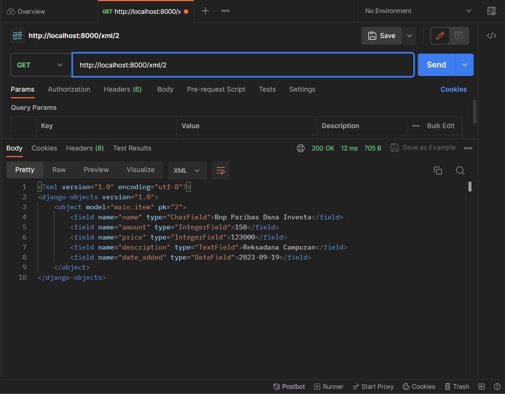

[Investment Portofolio Inventory Application Link](https://investment-portofolio-inventory.adaptable.app)
<h1>Tugas 3</h1>

# Langkah-langkah

## Membuat Form

Buatlah file `forms.py` pada direktori main yang akan mengimplementasikan library `django.forms` dengan isi dibawah ini
```python
from django.forms import ModelForm
from main.models import Item

class ItemForm(ModelForm):
    class Meta:
        model = Item
        fields = ["name", "amount", "price", "description"]
```

## Melakukan render form yang dibuat
Buatlah file `create_item.html` dalam folder `templates` yang ada di dalam direktori `main`
```html
 


<h1>Add New Item</h1>

<form method="POST">
    
    <table>
        {{ form.as_table }}
        <tr>
            <td></td>
            <td>
                <input type="submit" value="Add Item"/>
            </td>
        </tr>
    </table>
</form>


```

## Menambahkan fungsi `views` untuk serializer xml dan json
Serializer berguna untuk mengembalikan data dalam bentuk `json` dan `xml`
```python
from django.core import serializers
from main.models import Item

...
def show_xml(request):
    data = Item.objects.all()
    return HttpResponse(serializers.serialize("xml", data), content_type="application/xml")

def show_json(request):
    data = Item.objects.all()
    return HttpResponse(serializers.serialize("json", data), content_type="application/json")
```

## Mengembalikan data berdasarkan ID dalam bentuk xml dan jason

1. Menambahkan function untuk mengembalikan data berdasarkan ID
```python
def show_xml_by_id(request, id):
    data = Item.objects.filter(pk=id)
    return HttpResponse(serializers.serialize("xml", data), content_type="application/xml")

def show_json_by_id(request, id):
    data = Item.objects.filter(pk=id)
    return HttpResponse(serializers.serialize("json", data), content_type="application/json")
```

2. Buka `urls.py`` yang ada pada folder main dan impor fungsi yang sudah dibuat
```python
from main.views import show_main, create_product, show_xml, show_json, show_xml_by_id, show_json_by_id 
```

3. Tambahkan path url ke dalam `urlpatterns`` untuk mengakses fungsi yang sudah diimpor tadi.
```python
...
path('xml/<int:id>/', show_xml_by_id, name='show_xml_by_id'),
path('json/<int:id>/', show_json_by_id, name='show_json_by_id'), 
...
```
## Perbedaan antara form POST dan form Get pada Django
Form **POST** digunakan ketika ingin mengirim data dari halaman web ke server secara rahasia dan aman. Data yang dikirim melalui metode POST tidak terlihat dalam URL, sehingga lebih sesuai untuk mengirim data sensitif seperti kata sandi atau informasi pribadi pengguna. Form POST juga digunakan untuk mengirim data yang akan mengubah status atau mengupdate sumber daya di server, seperti mengisi formulir pendaftaran atau mengirim pesan melalui formulir kontak. Data ini akan diproses oleh server dan dapat digunakan untuk membuat, mengubah, atau menghapus data di database.

Form **GET** digunakan untuk mengambil data dari server dan menampilkan hasilnya kepada pengguna. Data yang dikirim melalui metode GET akan terlihat dalam URL, sehingga pengguna dapat melihatnya langsung. Form GET berguna untuk permintaan pencarian, tautan, atau penggunaan umum lainnya di mana pengguna dapat berinteraksi dengan data melalui URL, seperti melakukan pencarian di situs web atau menyusun tautan yang berisi parameter tertentu. Namun, karena data terbuka dalam URL, form GET tidak cocok untuk mengirim data sensitif dan tidak sebaik form POST dalam hal keamanan.

## Perbedaan utama antara XML, JSON, dan HTML dalam konteks pengiriman data
**XML** (eXtensible Markup Language) adalah format data yang menggunakan tag dan atribut untuk mendefinisikan struktur data hierarkis. Ini sering digunakan dalam pertukaran data antara aplikasi yang berbeda, terutama dalam lingkungan yang heterogen, karena kemampuannya untuk menggambarkan struktur data yang kompleks dan beragam.

**JSON** (JavaScript Object Notation) adalah format ringan yang menyimpan dan mengirim data dalam bentuk objek dan array yang mudah dibaca oleh manusia. JSON sangat populer dalam pengembangan web modern dan aplikasi API karena struktur yang sederhana dan efisien dalam pengiriman data melalui jaringan.

**HTML** (HyperText Markup Language) adalah bahasa markup yang digunakan untuk membuat halaman web dan menampilkan konten dalam bentuk dokumen yang dapat ditampilkan di browser. Ini tidak digunakan untuk pertukaran data langsung antara aplikasi, tetapi untuk merender tampilan dan struktur halaman web untuk pengguna akhir.

## Mengapa JSON sering digunakan dalam pertukaran data antara aplikasi web modern?
JSON sering digunakan dalam pertukaran data antara aplikasi web modern karena formatnya yang ringan, mudah dibaca, dan fleksibel, yang memungkinkan pengembang untuk menyimpan dan mengirim data dengan efisien, terutama dalam konteks aplikasi API. Selain itu, JSON didukung oleh sebagian besar bahasa pemrograman, memudahkan konversi data antara berbagai aplikasi, dan kompatibel dengan JavaScript, yang umum digunakan dalam pengembangan web, sehingga mempermudah pemrosesan data di sisi klien.

# Postman Screenshot
Gambaran response untuk `html`
<div style='display: flex;'>
    
</div>

Gambaran response untuk `/xml` dan `/xml/1`
<div style='display: flex;'>
    
    
</div>

Gambaran response untuk `/json` dan `/json/1`
<div style='display: flex;'>
    
    
</div>

-----

<h1>Tugas 2</h1>

# Langkah-langkah

## Menyiapkan Library yang diperlukan
Membuat file 'requirements.txt' dengan isi
```
django
gunicorn
whitenoise
psycopg2-binary
requests
urllib3
```

Lakukan installasi pada terminal dengan:
1. Tanpa Virtual Environment
```sh
pip install -r requirements.txt
```
2. Menggunakan Virtual Environment
```sh
python -m venv venv # membuat virtual env
./venv/Scripts/activate # melakukan aktivasi pada windows
pip install -r requirements.txt
```

## 1. Membuat proyek Django

Buat direktori baru bernama `NAME` dengan menggunakan command `django-admin createproject NAME`.
Direktori ini akan berisi file `manage.py` yang berisi script pyhton yang akan digunakan untuk mengatur proyek dan folder `NAMA` yang berisi setting dan routing dari proyek. 
Untuk menjalankan proyek, gunakan command `python manage.py runserver`

## 2. Membuat aplikasi dengan nama main

Buat applikasi bernama `APPNAME` dengan menggunakan command `python manage.py createapp APPNAME`. Lalu daftarkan applikasi yang telah dibuat kedalam `settings.py` pada folder proyek dengan menambahkan `APPNAME` pada bagian `INSTALLED_APPS` sehingga seperti di bawah ini
```python
INSTALLED_APPS = [
    'django.contrib.admin',
    'django.contrib.auth',
    'django.contrib.contenttypes',
    'django.contrib.sessions',
    'django.contrib.messages',
    'django.contrib.staticfiles',
    'APPNAME'
]
```

## 3. Mengonfigurasi Routing URL
Melakukan koknfigurasi link `APPNAME` dengan menambahkan command `path('aplikasi/', include('main.urls'))` pada `urls.py` yang terletak di direktori proyek sehingga seperti dibawah ini
```python
from django.contrib import admin
from django.urls import path, include
from main.views import show_main

app_name = 'main'

urlpatterns = [
    path('', show_main, name='show_main'),
]

```
Tambahkan rute URL seperti berikut untuk mengarahkan ke tampilan 'main' di dalam variabel 'urlpatterns'.
```python
urlpatterns = [
	path('main/', include('main.urls')),
]
```

## 4. Implementasi Template
Buat direktori 'templates' pada 'APPNAME'dan masukkan html 'main.html' seperti dibawah ini
```html
<head>
<title>Investment Portofolio Inventory</title>  
</head>

<body>
<h5>Name: </h5>
<p>Henry Soedibjo</p>
<h5>Class: </h5>
<p>PBP A</p> 
<h5>Amount: </h5>
<p>100</p> 
<h5>Description </h5>
<p>henrysoed Investment Portofolio Inventory for individu task 2 PBP</p> 
</body>
```
pada `views.py` kita dapat mengembalikan `main.html` dengan cara
```python
from django.shortcuts import render
from django.http import HttpResponse

def main(request):
    return render(request, 'main.html', context)
```

## 5. Membuat model sebagai Database

Model berfungsi sebagai penghubung python dengan database.Pada Tugas 2 PBP ini, saya ingin membuat database yang berisi nama, amount, dan description masing-masing dengan tipe data character, integer, dan text. Oleh karena itu saya melakukan memodifikasi file `models.py` seperti dibawah ini
```python
from django.db import models

class Product(models.Model):
    name = models.CharField(max_length=255)
    amount = models.IntegerField()
    description = models.TextField()
```

## Melakukan deployment ke Adaptable
Pastikan repository proyek sudah berada pada github dan bersifat public. Selanjutnya, pada adaptable, pilih opsi `deploy a new app`. Pilih repository sesuai proyek yang akan dideploy. Kemudian `Python App Template`. Selanjutnya adalah opsi database, sementara bisa menggunakan `PostgreSQL`. Sesuaikan versi python dengan versi lokal, `python --version` pada terminal lokal untuk melihat versi. Dan masukan `python manage.py migrate && gunicorn NAMA_PROYEK.wsgi` pada `Start Command`. Tentukan nama applikasi dan checklist `HTTP Listener on PORT`.

# Bagan Request Client ke Web Applikasi Berbasis Django


1. Seorang pengguna meminta browsernya untuk mengakses situs yang menggunakan Django sebagai basisnya
2. Browser akan mengirimkan permintaan HTTP (HTTP Request) untuk halaman web ke server aplikasi
3. Permintaan ini akan mencapai routing yang diatur dalam file `urls.py`, yang akan mencari pola URL yang sesuai dengan permintaan dari pengguna.
4. Setelah pola URL ditemukan, Django akan menjalankan fungsi yang terkait dalam file `views.py` yang telah terhubung dengan URL tersebut.
5. File `views.py` dapat melakukan berbagai logika dan operasi terhadap basis data yang telah didefinisikan dalam struktur model yang ada dalam file `models.py`.
6. Setelah operasi selesai, `views.py`akan mengirimkan halaman web yang diminta oleh pengguna dalam format HTML, yang tersimpan dalam direktori `templates`.
7. Browser pengguna kemudian akan merender HTML yang diterima sebagai respons (HTTP Response) dari server Django.

# Mengapa menggunakan Virtual Environment
Virtual environment digunakan dalam pengembangan aplikasi web berbasis Django untuk memisahkan dan mengisolasi dependensi proyek yang berbeda, mencegah konflik antarversi Python dan paket, serta memungkinkan manajemen dependensi yang lebih baik. Meskipun mungkin memungkinkan untuk membuat aplikasi Django tanpa virtual environment, penggunaannya sangat disarankan untuk menjaga kebersihan dan portabilitas kode proyek.

# Apa itu MVC, MVT, dan MVVM
1. MVC (Model View Controller) adalah paradigma desain arsitektur yang memisahkan aplikasi menjadi tiga komponen utama yaitu model (data dan logika bisnis), view (tampilan), dan controller (pengontrol aliran data).
2. MVT (Model-View-Template) adalah paradigma desain arsitektur yang merupakan variasi dari MVC yang digunakan dalam kerangka kerja Django, di mana model (data dan logika bisnis) tetap sama, view (tampilan) lebih berfokus pada presentasi data, dan template digunakan untuk memisahkan logika presentasi.
3. MVVM (Model-View-ViewModel) adalah paradigma desain arsitektur yang memisahkan aplikasi menjadi tiga komponen utama yaitu model (data dan logika bisnis), view (tampilan), dan ViewModel (perantara antara Model dan View yang mengelola tampilan data dan logika presentasi).
